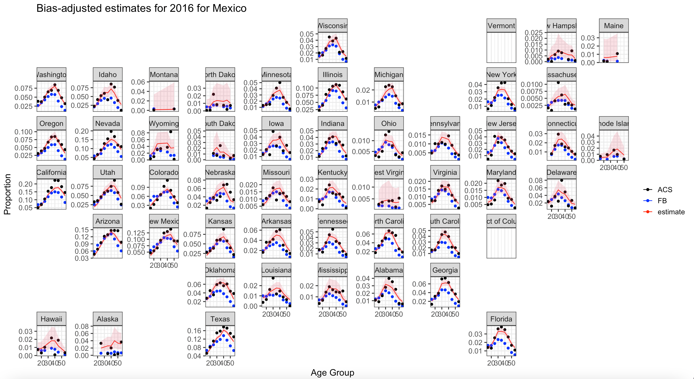
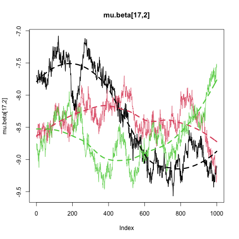
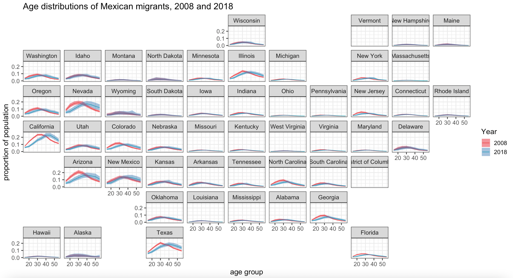
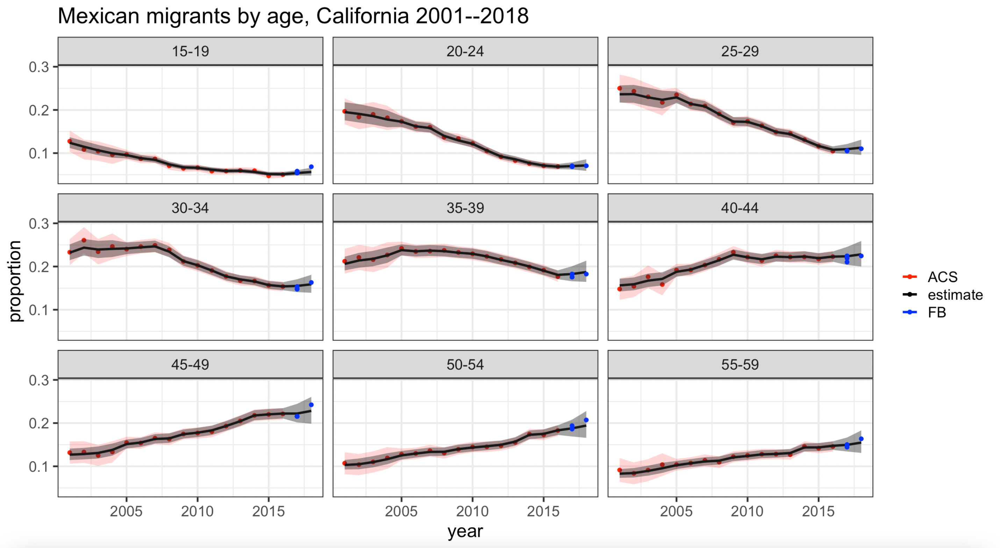
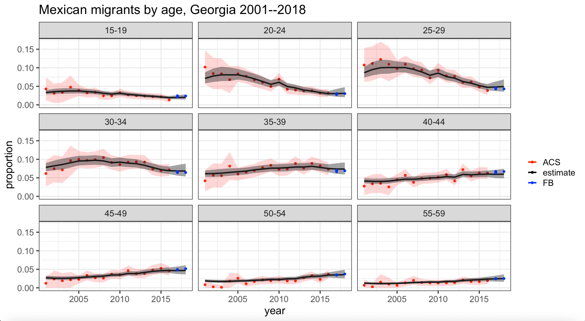

```{r setup, include=FALSE}
knitr::opts_chunk$set(echo = TRUE, warning = F, message = F,include=T,eval=T)
```

# Introduction

Today we'll be walking through the paper [Combining Social Media and Survey Data to Nowcast Migrant Stocks in the United States](https://link.springer.com/article/10.1007%2Fs11113-020-09599-3) by Alexander, Polimis, and Zagheni (2020). Here is a link to the corresponding [Git repo](https://github.com/MJAlexander/fb-migration-bayes) made by the authors. I have created a modified version that includes this tutorial and makes some changes to their code so that it can run off the shelf, which can be found [here](https://github.com/njirons/migration_tutorial).

To quote from the abstract:

> Measuring and forecasting migration patterns has important implications for understanding broader population trends, for designing policy effectively and for allocating resources. However, data on migration and mobility are often lacking, and those that do exist are not available in a timely manner. Social media data offer new opportunities to provide more up-to-date demographic estimates and to complement more traditional data sources.

The goal of the paper is to supplement the infrequent but (relatively) high quality American Community Survey (ACS) with more timely but biased Facebook (FB) data to estimate and forecast US migrant stocks from various countries in each state broken down by age. The hope is that we can develop a model relating the ACS and FB data, which will allow us to de-bias the FB data to produce more up-to-date estimates and forecasts of migrant stocks. Furthermore, by combining multiple data sources, we should be able to improve the precision of our estimates. The Bayesian model developed by the authors has quite a few moving parts and uses a number of interesting statistical techniques, including autoregressive time series, hierarchical modeling, and principal component analysis (PCA), in order to pool information across time and space and for dimensionality reduction, respectively.

In this tutorial, we'll load in and process the data, do some visualization to get a sense of what it looks like, and run some models to produce estimates and forecasts of migrant stocks. We'll be looking specifically at migrants from Mexico, which is the top country of origin for migrants in the US.

# Data sources

```{r}
if (!require("pacman")) install.packages("pacman")
pacman::p_load(tidyverse,here,dplyr, ggplot2, knitr,boot,
               kableExtra, readr,ggpubr,geofacet,maps, tidycensus)
```

## FB data

There are five waves of Facebook Ads Manager data, collected every 2-3 months beginning in January 2017, available at the paper’s GitHub repository. Each wave of data contains state-level estimates of the number of total Facebook users and the number of individuals from 90 “expat” groups by age, sex (five-year age groups), gender, and country of origin. These estimates, provided by Facebook for Business’s Ads Manager platform and available via Facebook’s Marketing API, are defined as the “potential reach”, or monthly active users, in this group. While not representative of the entire US population, these data are updated frequently, as compared to the 1-year ACS.

To quote the authors:

> Facebook for Business has developed a targeted advertising platform, called Ads Manager that provides a graphical user interface to allow advertisers to micro-target specific audiences. Demographic characteristics that can be targeted include information directly reported by Facebook users, such as age or sex, and information indirectly inferred from using Facebook’s platform or affiliated websites, such as location and behavioral interests. Before launching an advertisement, an advertiser can select a variety of characteristics (e.g., Australians living in California, who are female, and aged 30–35) and get an estimate of the ‘potential reach’ (monthly active users) to this subgroup. These estimates can be obtained, in a programmatic way, for a variety of different migrant groups (i.e., by age and sex) to whom Facebook refers as expatriates (‘expats’).
> We use the estimates of potential reach by expat group, age and sex to track sizes of migration stocks over time. These estimates can be obtained before the launch of an advertisement, and as such are obtained free of charge. We use the Ads Manager back-end application, Facebook’s Marketing API, to extract estimates of potential reach over time programmatically with the Python module pySocialWatcher (Araujo et al. 2017). With pySocialWatcher, we collected data across 11 age groups (10 UN age groups from 15–19 to 60–65; an 11th group for the entire available Facebook population of 13–65 was also used) and three gender groups (female, male, and total population).

Let's start by loading in the data.

```{r}
# read in facebook data 

# load in each wave
d1 <- read_csv(here("data","master_acs_facebook_expat_wave1.csv"))
d2 <- read_csv(here("data","master_acs_facebook_expat_wave2.csv"))
d3 <- read_csv(here("data","master_acs_facebook_expat_wave3.csv"))
d4 <- read_csv(here("data","master_acs_facebook_expat_wave4.csv"))
d5 <- read_csv(here("data","master_acs_facebook_expat_wave5.csv"))
  
# bind all these together

df <- d3 %>% 
  rename(expat_population = expat_population_wave3, 
         facebook_population = facebook_population_wave3) %>% 
  mutate(wave = 3) %>% 
  bind_rows(d4 %>%
              rename(expat_population = expat_population_wave4, 
                     facebook_population = facebook_population_wave4) %>% 
              mutate(wave = 4)) %>% 
  bind_rows(d5 %>% 
              rename(expat_population = expat_population_wave5, 
                     facebook_population = facebook_population_wave5) %>% 
              mutate(wave = 5)) %>% 
  bind_rows(d1 %>% 
              rename(expat_population = expat_population_wave1, 
                     facebook_population = facebook_population_wave1) %>% 
              mutate(wave = 1)) %>% 
  bind_rows(d2 %>% 
              rename(expat_population = expat_population_wave2, 
                     facebook_population = facebook_population_wave2) %>% 
              mutate(wave = 2))
```

See what variables are contained in `df`.
```{r}
names(df)
```

Take a peek at the first few rows of data.
```{r}
head(df) %>%
  kable() %>%
  kable_styling(bootstrap_options = c("striped", "hover", "condensed","responsive"), 
                full_width = F, position="left")
```

The columns we will mainly be interested in are `origin` (country of origin), `state` (US state of residence), `age_group` (5 year age group from 15 to 60), and `expat_population` (number of expats). To simplify the analysis, and following the paper, we only consider the male population (`sex == 1`). In the code below, we calculate `exp_prop` (expat proportion in the FB population), `se` (binomial standard errors for this proportion meant to approximate sampling errors), and do some other data cleaning.

```{r}
# keep males, get age groups, calculate proportions and binomial standard errors
fb_prop_age_new <- df %>% 
  filter(sex == 1) %>% 
  mutate(exp_prop = expat_population/facebook_population) %>% 
  mutate(se = sqrt(exp_prop*(1-exp_prop)/facebook_population),
         se_log = se/exp_prop) %>% 
  mutate(age_group = as.numeric(unlist(lapply(strsplit(ages_ranges, "_"), '[[', 2)))) %>% 
  select(age_group, state, origin, expat_population, facebook_population, exp_prop, se, se_log, wave) 

# restrict to country of interest
origin_country <- "Mexico"
fb_prop_age_new_org <- (fb_prop_age_new %>% filter(origin==origin_country))

## REMOVE Vermont for Mexico, for some reason not in ACS
fb_prop_age_new_org <- fb_prop_age_new_org %>% filter(state != "Vermont")

# get rid of underscores in state names
fb_prop_age_new_org <- fb_prop_age_new_org %>% 
  mutate(state = gsub("_", " ", state))
```

Now we can plot a choropleth map to visualize the spatial distribution of Mexican migrants to the US as reflected in the FB data.

```{r}
# load United States state map data
state_map <- map_data("state")

# create variable to match state_map "region" state names (lowercase)
fb_prop_age_new_org$region <- tolower(fb_prop_age_new_org$state)

# merge FB data with map data
merged_fb <- inner_join(state_map,
                        fb_prop_age_new_org %>%
                          group_by(region) %>%
                          filter(wave == 1) %>%
                          summarize(exp_pop = sum(expat_population),
                                    fb_pop = sum(facebook_population),
                                    exp_prop = exp_pop/fb_pop),
                              by = "region")

p <- ggplot() + 
  geom_polygon(data=merged_fb, 
                       aes(x=long, y=lat, group=group, fill = 100*exp_prop), 
                       color="white", size = 0.2) +
  theme_void() +
  labs(title = "Mexican migrant percent of male Facebook population aged 15-59, January 2017") + 
  scale_fill_continuous(name="Percent", 
                        low = "darkblue", high = "darkred")
p
```

We see that, as we might expect, the southwestern states have the highest proportion of Mexican migrants among thei FB population.

## ACS data

>The American Community Survey (ACS) is an annual survey of the U.S. Census Bureau, designed to supplement the decennial census. Based on the long-form version of the census, the ACS collects information on topics including population, housing, employment and education from a nationally representative sample. Data on migrant stocks can be readily obtained from the ACS. In particular, in every year of the ACS, the survey has contained a question asking the birthplace of the person; if it is inside the United States, the state is recorded, and if it is outside the United States, the country is recorded. This birthplace variable is recorded as a three digit code to indicate the US state or country of birth. In addition to the birthplace variable, the ACS has information on current state of residence. Thus, we can tabulate the number of migrants from a particular country living in a particular state by looking at the combination of these two variables. From a modeling perspective, we are interested in the proportion of migrants from a particular origin of the total population by 5-year age groups (15–19, 20–24,..., 50–54) in each state.

We will be using the 1-year ACS microdata sample from the [Integrated Public Use Microdata Sample (IPUMS) USA project](https://usa.ipums.org/usa/index.shtml) using the “select data” feature. I extracted data for each year between 2001 and 2017  on the variables: YEAR, STATEFIP, PERWT (person/sampling weight), SEX, AGE (five-year age group), and BPL (birthplace, US state or country). The STATEFIP and BPL variables in particular allow us to calculate the number of migrants from a specific country living in each US state. These data are also accessible via $\texttt{tidycensus}$ using the `get_pums()` function. However, it takes a long time to download the microdata for all states in this way. Furthermore, data before 2005 are not available through $\texttt{tidycensus}$ (as far as I know). Therefore, I highly recommend downloading it from IPUMS USA directly. Since the model only uses aggregate counts of migrants in each state, I think (?) we could also get by just using `get_acs()`, but not sure. 
<!---
I'm pretty sure that's why the authors chose to use the microdata sample and download it from IPUMS as opposed to just using `get_acs()`, since they only use aggregate counts of migrants in each state, which are probably (?) available via `get_acs()`. Anyway, I didn't have the time to completely re-code their data processing pipeline to use `get_acs()` instead. My apologies.
--->

We first load in the data. My code assumes you have downloaded the IPUMS data extract and saved it in the current folder as `acs_ipums.RDS`. We then calculate the number and proportion of migrants in each state from each country of origin. Note that the number of migrants from a country is just the number of people in that state who were born in that country.

```{r}
# specify country of origin
origin_country <- "Mexico" 

# Read in ACS data  ---------------------------------

### Note: These data were downloaded from IPUMS USA. 
### ACS 1 year with the following variables: YEAR; STATEFIP; PERWT; SEX; AGE; BPL 
### for all years 2001-2016

acs_file <- "acs_ipums.RDS"
dc <- readRDS(acs_file)

# for this project, just keep males. 
# starting age group is 15-19. also define age_group variable

dc <- dc %>% 
  filter(SEX==1, 
         AGE>14) %>% 
  mutate(age_group = as.numeric(as.character(cut(AGE, 
                                                 breaks = c(seq(15, 80, by = 5), Inf),
                                                 labels = seq(15, 80, by = 5), right = FALSE
  ))))

# get proportions of migrants by age group
# filter so that birthplace only refers to international locations

acs_prop_age <- dc %>% 
  group_by(age_group, YEAR, STATEFIP, BPL) %>% 
  summarise(no_mig = sum(PERWT)) %>% 
  group_by(age_group, YEAR, STATEFIP) %>% 
  mutate(prop_mig = no_mig/(sum(no_mig)), pop = sum(no_mig)) %>% 
  rename(bpl = BPL, year = YEAR) %>%
  filter(bpl>99, age_group < 60) %>% 
  ungroup()

# get state name, STATEFIP key-value pairs
labs <- attributes(acs_prop_age$STATEFIP)$labels

# match state name to FIP
acs_prop_age$state <- (names(labs)[match(acs_prop_age$STATEFIP, labs)])

# read in birthplace codes and get names
bpl_names <- read_csv(here("data", "origin_names.csv"))

# merge ACS with birthplace names
acs_prop_age <- acs_prop_age %>% 
  left_join(bpl_names %>% 
              rename(bpl = bpl_no))
```

Let's look at the first few rows.

```{r}
head(acs_prop_age) %>%
  kable() %>%
  kable_styling(bootstrap_options = c("striped", "hover", "condensed","responsive"), 
                full_width = F, position="left")
```

The next code chunk calculates standard errors on the estimates using reported design weights. Standard errors around the calculated proportions based on sampling variation were obtained based on ACS accuracy guidelines (US Census Bureau 2020) and using the delta method. These will be used downstream in the model to quantify uncertainty. We also calculate total population in each age group by state and year to use for later.

```{r}
# Calculate standard errors -----------------------------------------

# see: https://www2.census.gov/programs-surveys/acs/tech_docs/pums/accuracy/ for dfs and formulas
design_factors <- tibble(year = 2001:2016, df = c(rep(2.9, 4), rep(2.2, 4), rep(2, 3), rep(1.9, 5)))

# mean and variance 
# http://www.biostat.jhsph.edu/~tlouis/bio752-753/651-2/files/deltaMethod.pdf

acs_prop_age <- acs_prop_age %>% 
  left_join(design_factors) %>% 
  mutate(se = case_when(
    year < 2005 ~ 1.2*df*sqrt(142/pop*prop_mig*(1-prop_mig)), 
    year >= 2005 ~ df*sqrt(99/pop*prop_mig*(1-prop_mig)),
    TRUE ~ 0),
    se_log = se/prop_mig,
    se_logit = se/(prop_mig*(1-prop_mig)))


# Calculate total populations ------------------------------------------

total_pops <- dc %>% 
  group_by(age_group, YEAR, STATEFIP, BPL) %>% 
  summarise(no_mig = sum(PERWT)) %>% 
  group_by(age_group, YEAR, STATEFIP) %>% 
  mutate(prop_mig = no_mig/(sum(no_mig)), pop = sum(no_mig)) %>% 
  rename(bpl = BPL, year = YEAR) %>%
  filter(age_group < 60) %>% 
  arrange(year, STATEFIP, age_group, bpl) %>% 
  group_by(year, STATEFIP, age_group) %>% 
  filter(row_number()==1) %>% 
  ungroup() %>% 
  select(age_group, year, STATEFIP, pop)

# match state name to FIP
total_pops$state <- (names(labs)[match(total_pops$STATEFIP,labs)])

# restrict to country of interest
acs_prop_age_org <- (acs_prop_age %>% filter(origin==origin_country))

# for merging with state map data
acs_prop_age_org$region <- tolower(acs_prop_age_org$state)
```

Plot a choropleth map to visualize the spatial distribution of Mexican migrants to the US as reflected in the ACS data.

```{r}
# merge ACS data with state map data
merged_acs <- inner_join(state_map, 
                        acs_prop_age_org %>%
                          group_by(region) %>%
                          filter(year == 2016) %>%
                          summarize(no_mig = sum(no_mig),
                                    pop = sum(pop),
                                    prop_mig = no_mig/pop),
                        by = "region")

q <- ggplot() + 
  geom_polygon(data=merged_acs, 
               aes(x=long, y=lat, group=group, fill = 100*prop_mig), 
               color="white", size = 0.2) +
  theme_void() +
  labs(title = "Mexican immigrants as percent of 2016 ACS male population aged 15-59") + 
  scale_fill_continuous(name="Percent", 
                        low = "darkblue", high = "darkred")
q
```

## Comparing the two

The choropleth maps we've looked at show Mexican immigrants in each state as a percentage of the male population aged 15-59 (i) in the wave 1 (January 2017) Facebook Ad platform data, and (ii) as estimated by the 2016 ACS. Let's plot the two side-by-side to compare.

```{r}
ggarrange(p,q,nrow=2)
```

The two maps appear to be highly concordant, with the southwestern states showing the largest proportions of Mexican immigrants. One notable difference appears to be a systematic underestimation of Mexican immigrants as a proportion of the population from the FB data as compared to the ACS. (Note the color scales on each heatmap.) We might expect Mexican immigrants to be less represented on FB for socioeconomic reasons, in which case this discrepancy is not surprising.

# Modeling

As Alexander et al. write,

> We are considering two data sources of migration trends in the US: data from Facebook’s Advertising Platform, and the ACS. The overall goal of the modeling strategy is to combine information from both these sources to produce estimates of current and future migrant stocks. To do this, the model should have three main characteristics. Firstly, we want to adjust for biases in Facebook data to effectively use up-to- date information on migration patterns from this source. Secondly, we want to be able to incorporate longer time series of information from the ACS. Finally, the data should be combined in a probabilistic way, in order to objectively weigh information from both sources. We propose a Bayesian hierarchical model which achieves these goals. 

## FB bias model

The maps we just looked at suggest that the FB data are indeed biased, but in a systemic way that we can model. Prior work by [Zagheni et al. (2017)](https://onlinelibrary.wiley.com/doi/full/10.1111/padr.12102) developed a regression model to adjust the Facebook data to account for the non-representativeness of the Facebook user population. Their model calibrates FB data to the ACS via the following formula:
$$
\log p_{x,t,s}^{ACS} = b_0 + b_{FB}\log p_{x,t,s}^{FB} + X b + \epsilon_{FB},
$$
where $p_{x,t,s}$ denotes the proportion of migrants in age group $x$, time period $t$, and state $s$ for each data source. Here $X$ is a matrix of covariates encoding indicator variables for each age group (15–19, 20–24,..., 50–54) and each of the 50 states plus Washington, D.C. In other words, they estimate an individual fixed effect for each age group and state. The error terms are assumed IID and normally distributed, $\epsilon_{FB}\sim N(0,\sigma_{FB}^2)$.

Estimates of the coefficients $\hat b_0,\hat b_{FB},\hat b$ are obtained using the first wave of the Facebook data (January 2017) and the 2016 ACS data. These coefficient estimates are then used to calibrate subsequent waves of Facebook data to arrive at the bias-adjusted proportions $p_{x,t,s}^{*}$ given by:
$$
\log p_{x,t,s}^{*} = \hat b_0 +\hat b_{FB}\log p_{x,t,s}^{FB} + X\hat b
$$
In fitting this model, we also obtain an estimate of the error variance $\hat\sigma_{FB}^2$, which is used again downstream in the full model.

## JAGS: Just Another Gibbs Sampler

In order to fit the bias-adjustment model just described (as well as the final full model), we will use JAGS, which is a popular and easy-to-use statistical software designed for Bayesian analysis. JAGS implements Gibbs sampling, a Markov Chain Monte Carlo (MCMC) algorithm, to estimate the posterior distribution of the model parameters. JAGS can be run in R with the $\texttt{rjags}$ and $\texttt{R2jags}$ packages. I will walk you through the basics of setting up a JAGS program and getting models running.

We'll begin by massaging the ACS 2016 and Wave 1 FB data into the appropriate format. I start off by reading in the file `acs_for_fb.RDS`, which I did not define yet in this tutorial. I figured it wouldn't be instructive to copy and paste the paper's entire data processing pipeline.

I have included the code necessary to generate this file in a hidden chunk just below this paragraph, which you can find in the R Markdown document and run if you want to follow along. The code is a modification of the `1_acs_data_format.R` file at the paper's Git repo. I had to make some changes (shown in the commented out sections) because the author's code threw some errors when I tried to run it off the shelf. For those interested, I can also share a folder with all of the necessary R scripts to reproduce the paper's results, including my fixes of bugs in the original code.

```{r, eval=F,include=F}
##### Facebook migration project
##### 1. Format and save ACS data

### Note: These data were downloaded from IPUMS USA. 
### ACS 1 year with the following variables: YEAR; STATEFIP; PERWT; SEX; AGE; BPL 
### for all years 2001-2016


# 0. Packages -------------------------------------------------------------

library(tidyverse)
library(boot)
#library(narcan) # this is a working package. Used to get fips codes/names dictionary. https://github.com/mkiang/narcan
library(here)


# 1. Read in data  ---------------------------------


### Note: These data were downloaded from IPUMS USA. 
### ACS 1 year with the following variables: YEAR; STATEFIP; PERWT; SEX; AGE; BPL 
### for all years 2001-2016

acs_file <- "acs_ipums.RDS"
#dc <- read_csv(acs_file)
dc <- readRDS(acs_file)

# for this project, just keep males. 
# starting age group is 15-19.

dc <- dc %>% 
  filter(SEX==1, 
         AGE>14) %>% 
  mutate(age_group = as.numeric(as.character(cut(AGE, 
                                                 breaks = c(seq(15, 80, by = 5), Inf),
                                                 labels = seq(15, 80, by = 5), right = FALSE
  ))))


# get proportions of migrants by age group
# filter so that birthplace only refers to international locations

acs_prop_age <- dc %>% 
  group_by(age_group, YEAR, STATEFIP, BPL) %>% 
  summarise(no_mig = sum(PERWT)) %>% 
  group_by(age_group, YEAR, STATEFIP) %>% 
  mutate(prop_mig = no_mig/(sum(no_mig)), pop = sum(no_mig)) %>% 
  rename(bpl = BPL, year = YEAR) %>%
  filter(bpl>99, age_group < 60, year %in% 2001:2016) %>% 
  ungroup()

## make statefip 1-9 be 01-09
acs_prop_age$state_fip <- ifelse(acs_prop_age$STATEFIP<10, paste0("0", acs_prop_age$STATEFIP), as.character(acs_prop_age$STATEFIP))

labs <- attributes(acs_prop_age$STATEFIP)$labels
#acs_prop_age$state <- tolower(names(labs)[match(acs_prop_age$STATEFIP, labs)])
acs_prop_age$state <- names(labs)[match(acs_prop_age$STATEFIP, labs)]

# read in US state codes to get the names
#rep_pattern <- narcan::st_fips_map$name
#names(rep_pattern) <- narcan::st_fips_map$fips
#acs_prop_age$state <- stringr::str_replace_all(acs_prop_age$state_fip, pattern = rep_pattern)

# read in birthplace codes and get names
bpl_names <- read_csv(here("data", "origin_names.csv"))

acs_prop_age <- acs_prop_age %>% 
  left_join(bpl_names %>% 
              rename(bpl = bpl_no))

# 2. Calculate standard errors -----------------------------------------

# see: https://www2.census.gov/programs-surveys/acs/tech_docs/pums/accuracy/ for dfs and formulas
design_factors <- tibble(year = 2001:2016, df = c(rep(2.9, 4), rep(2.2, 4), rep(2, 3), rep(1.9, 5)))

# mean and variance 
# http://www.biostat.jhsph.edu/~tlouis/bio752-753/651-2/files/deltaMethod.pdf

acs_prop_age <- acs_prop_age %>% 
  left_join(design_factors) %>% 
  mutate(se = case_when(
    year < 2005 ~ 1.2*df*sqrt(142/pop*prop_mig*(1-prop_mig)), 
    year >= 2005 ~ df*sqrt(99/pop*prop_mig*(1-prop_mig)),
    TRUE ~ 0),
    se_log = se/prop_mig,
    se_logit = se/(prop_mig*(1-prop_mig)))


# 3. Calculate total populations ------------------------------------------

total_pops <- dc %>% 
  group_by(age_group, YEAR, STATEFIP, BPL) %>% 
  summarise(no_mig = sum(PERWT)) %>% 
  group_by(age_group, YEAR, STATEFIP) %>% 
  mutate(prop_mig = no_mig/(sum(no_mig)), pop = sum(no_mig)) %>% 
  rename(bpl = BPL, year = YEAR) %>%
  filter(age_group < 60, year %in% 2001:2016) %>% 
  arrange(year, STATEFIP, age_group, bpl) %>% 
  group_by(year, STATEFIP, age_group) %>% 
  filter(row_number()==1) %>% 
  ungroup() %>% 
  select(age_group, year, STATEFIP, pop)

total_pops$state_fip <- ifelse(total_pops$STATEFIP<10, paste0("0", total_pops$STATEFIP), as.character(total_pops$STATEFIP))
#total_pops$state <- stringr::str_replace_all(total_pops$state_fip, pattern = rep_pattern)

#total_pops$state <- tolower(names(labs)[match(total_pops$STATEFIP,labs)])
total_pops$state <- names(labs)[match(total_pops$STATEFIP,labs)]

# 4. Save file for fitting Facebook model ---------------------------------

# for this we only need 2016

acs_for_fb <- acs_prop_age %>% filter(year==2016)

saveRDS(acs_for_fb, here("data", "acs_for_fb.RDS"))


# 5. Save file for combined model -----------------------------------------

saveRDS(acs_prop_age, here("data", "acs_for_model.RDS"))


# 6. Save total populations -----------------------------------------------

saveRDS(total_pops, here("data", "acs_total_pop.RDS"))


# 7. Do the same thing for the year 2017 ----------------------------------

#acs_file_17 <- "path/to/your/file"
#d17 <- read_csv(acs_file_17)

d17 <- dc %>% 
  filter(YEAR==2017, SEX==1, AGE>14, AGE<60) %>% 
  mutate(age_group = as.numeric(as.character(cut(AGE, 
                                                 breaks = c(seq(15, 80, by = 5), Inf),
                                                 labels = seq(15, 80, by = 5), right = FALSE
  ))))


# get proportions of mexicans by age group

acs_prop_age_17 <- d17 %>% 
  group_by(age_group, YEAR, STATEFIP, BPL) %>% 
  summarise(no_mig = sum(PERWT)) %>% 
  group_by(age_group, YEAR, STATEFIP) %>% 
  mutate(prop_mig = no_mig/(sum(no_mig)), pop = sum(no_mig)) %>% 
  rename(bpl = BPL, year = YEAR) %>%
  filter(bpl>99, age_group < 60) %>% 
  ungroup()

## make statefip 1-9 be 01-09
acs_prop_age_17$state_fip <- ifelse(acs_prop_age_17$STATEFIP<10, paste0("0", acs_prop_age_17$STATEFIP), as.character(acs_prop_age_17$STATEFIP))

labs <- attributes(acs_prop_age_17$STATEFIP)$labels
#acs_prop_age_17$state <- tolower(names(labs)[match(acs_prop_age_17$STATEFIP, labs)])
acs_prop_age_17$state <- names(labs)[match(acs_prop_age_17$STATEFIP, labs)]

# read in codes to get the names
#rep_pattern <- narcan::st_fips_map$name
#names(rep_pattern) <- narcan::st_fips_map$fips
#acs_prop_age_17$state <- stringr::str_replace_all(acs_prop_age_17$state_fip, pattern = rep_pattern)

## need to get name of bpl
bpl_names <- read_csv(here("data", "origin_names.csv"))

# join 
acs_prop_age_17 <- acs_prop_age_17 %>% 
  left_join(bpl_names %>% rename(bpl = bpl_no)) %>% 
  select(age_group, year,  bpl,origin, state, prop_mig, pop)


### TOTAL POPS (for results later)

total_pops_17 <- d17 %>% 
  group_by(age_group, YEAR, STATEFIP, BPL) %>% 
  summarise(no_mig = sum(PERWT)) %>% 
  group_by(age_group, YEAR, STATEFIP) %>% 
  mutate(prop_mig = no_mig/(sum(no_mig)), pop = sum(no_mig)) %>% 
  rename(bpl = BPL, year = YEAR) %>%
  filter(age_group < 60) %>% 
  arrange(year, STATEFIP, age_group, bpl) %>% 
  group_by(year, STATEFIP, age_group) %>% 
  filter(row_number()==1) %>% 
  ungroup() %>% 
  select(age_group, year, STATEFIP, pop)

total_pops_17$state_fip <- ifelse(total_pops_17$STATEFIP<10, paste0("0", total_pops_17$STATEFIP), as.character(total_pops_17$STATEFIP))

#total_pops_17$state <- tolower(names(labs)[match(total_pops_17$STATEFIP,labs)])
total_pops_17$state <- names(labs)[match(total_pops_17$STATEFIP,labs)]

# read in codes to get the names
#rep_pattern <- narcan::st_fips_map$name
#names(rep_pattern) <- narcan::st_fips_map$fips
#total_pops_17$state <- stringr::str_replace_all(total_pops_17$state_fip, pattern = rep_pattern)


## need to get standard errors 

# see: https://www2.census.gov/programs-surveys/acs/tech_docs/pums/accuracy/ for dfs and formulas
design_factors <- tibble(year = 2001:2017, df = c(rep(2.9, 4), rep(2.2, 4), rep(2, 3), rep(1.9, 6)))

# mean and variance 
# http://www.biostat.jhsph.edu/~tlouis/bio752-753/651-2/files/deltaMethod.pdf

acs_prop_age_17 <- acs_prop_age_17 %>% 
  left_join(design_factors) %>% 
  mutate(se = case_when(
    year < 2005 ~ 1.2*df*sqrt(142/pop*prop_mig*(1-prop_mig)), 
    year >= 2005 ~ df*sqrt(99/pop*prop_mig*(1-prop_mig)),
    TRUE ~ 0),
    se_log = se/prop_mig,
    se_logit = se/(prop_mig*(1-prop_mig)))

saveRDS(acs_prop_age_17, here("data", "acs_prop_age_17.RDS"))
saveRDS(total_pops_17, here("data", "acs_total_pop_17.RDS"))
```

```{r}
# Packages -------------------------------------------------------------

library(rjags)
library(R2jags)


# Read in ACS ----------------------------------------------------------
origin_country <- "Mexico"
acs_prop_age <- readRDS(here("data", "acs_for_fb.RDS"))


# Read in FB data wave 1 and join to ACS-----------------------------------------------

d <- read_csv(here("data","master_acs_facebook_expat_wave1.csv"))

# filter to just males, calculate age group, calculate proportions
fb_prop_age <- d %>% 
  filter(sex==1) %>% 
  mutate(exp_prop = expat_population_wave1/facebook_population_wave1) %>% 
  mutate(age_group = as.numeric(unlist(lapply(strsplit(ages_ranges, "_"), '[[', 2)))) %>% 
  select(age_group, state, origin, expat_population_wave1, exp_prop) 


# join together with acs 
prop_age <- fb_prop_age %>% 
  left_join(acs_prop_age)

# remove missing ages
prop_age <- prop_age[!is.na(prop_age$prop_mig),]

# add an age group category
prop_age <- prop_age %>% mutate(age_group_cat = paste(age_group, age_group+4, sep = "-"))

# want to just look at one country of origin
prop_age <- prop_age %>% filter(origin == origin_country)

# Get data in format for JAGS ------------------------------------------

# make covariate matrix with first wave
x.i <- with(prop_age, model.matrix(log(prop_mig) ~ factor(age_group)+ factor(state)))
x.i <- x.i[,-1]
colnames(x.i) <- gsub("factor\\(.*\\)", "", colnames(x.i))
log_fb_prop.i <- log(prop_age$exp_prop)
```

OK, now we've defined all the relevant data that we will be plugging into JAGS. The first argument of the `jags()` function, which fits the model, is a named list of the input data: 

```{r}
# make a list of data for jags input

jags.data <- list(log_acs_prop = log(prop_age$prop_mig), 
                  se = prop_age$se_log,
                  n = nrow(x.i),
                  x.i = x.i,
                  K = ncol(x.i),
                  log_fb_prop.i = log_fb_prop.i)
```

Another argument of `jags()` is `parameters.to.save`. By default, `jags()` outputs MCMC samples of all the parameters of the model. However, this can result in memory issues if we have many parameters and/or many MCMC samples. `parameters.to.save` allows us to keep only those estimates that we care about. 

```{r}
# the parameters that we are interested in
parnames <- c("b0", "b_fb","b", "tau", "mu")
```

Some of these parameters are familiar ($b_0, b_{FB}, b$). The parameter $\tau$ is the reciprocal of the variance, $1/\sigma^2$, and is called the \emph{precision}. For [historical/obsolete reasons](https://stats.stackexchange.com/questions/161328/why-use-precision-instead-of-variance-in-a-prior), JAGS parametrizes distributions in terms of their precision rather than variance. The parameter $\mu$ is the mean of the bias-adjustment model, and it is defined in the model file. 

Another key argument of `jags()` is `model.file`, which is the name of a text file written in BUGS code defining the model. The BUGS (Bayesian inference Using Gibbs Sampling) project, started in 1989, developed programs underlying a number of popular statistical software packages, including JAGS.

The following JAGS model file `model_bias.txt` is included in the `models` folder of the paper's GitHub page. The bias-adjustment model is fairly simple, so it serves as a great starter example for people new to BUGS. Here are a few resources to get further acquainted with JAGS/BUGS syntax:

* [JAGS user manual](https://people.stat.sc.edu/hansont/stat740/jags_user_manual.pdf)
* [rjags CRAN manual](https://cran.r-project.org/web/packages/rjags/rjags.pdf)
* [rjags tutorial](https://rpruim.github.io/Kruschke-Notes/jags-just-another-gibbs-sampler.html)

I find that working through examples is usually more helpful than reading documentation.

```{r,echo=T,eval=F,include=T}
model {
  # bias model
  for(i in 1:n){
    log_acs_prop[i] ~ dnorm(mu[i], tau.y[i]) # likelihood on ACS data
    mu[i] <- b0 + b_fb*log_fb_prop.i[i]+ inprod(b[], x.i[i,]) # mean of regression model
    tau.y[i] <- pow(1/tau + pow(se[i], 2), -1) # define precision of error term
  }
  # priors on bias model
  tau ~ dgamma(.01,.01) # gamma prior on precision
  b0 ~ dnorm(0,1.0E-12) # (very) weakly informative normal prior
  b_fb ~ dnorm(0,1.0E-12) # (very) weakly informative normal prior
  for (k in 1:K) {
    b[k] ~ dnorm(0,1.0E-12) # (very) weakly informative normal prior
  }
}
```

Finally, with the data, parameters, and model defined, we are ready to generate some estimates using the `jags()` function. Due to its simplicity, the bias-adjustment model runs very quickly, so we can actually fit it in real time. 

(Aside: the final model is more involved and takes a while to converge, so I have saved MCMC samples from a previous run of the model, which I will be loading and using to generate plots of the estimates when we get there.)

Note that `jags()` has other arguments, which take default values if unspecified. In particular, the default number of samples to generate is 2000 per chain, using 3 chains, with a burn-in of 1000. Run the command `?jags` in the R console for further details. (Note: always run multiple chains in parallel. This is a must for diagnosing convergence issues with the sampler.)

Let's run it.

```{r}
# Run MCMC -------------------------------------------------------------
set.seed(2022)

mod <- jags(data = jags.data, 
            parameters.to.save=parnames,
            model.file = here("code/models","model_bias.txt"))
```

First things first, we need to check if there are any obvious signs that the chains have not converged. This model is simple and well-behaved enough that we have no reason to expect issues with mixing, but we will run through some of the basic diagnostics to familiarize ourselves. For a nice and concise rundown of best practice in MCMC diagnostics, check out this [blog post](https://statmodeling.stat.columbia.edu/2019/03/19/maybe-its-time-to-let-the-old-ways-die-or-we-broke-r-hat-so-now-we-have-to-fix-it/), with links to other great resources.

The code below calculates the maximum value of the Gelman-Rubin diagnostic $\hat{R}$ (or some variant of it) among all parameters. $\hat{R}$ essentially compares estimates of the within-chain and between-chain variances, the idea being that if there is more variance between chains than within, then the parallel chains can't have converged to the same distribution. If any $\hat{R} > 1.01$, we conclude that the chains have not converged and we must keep sampling.

```{r}
# check maximum Gelman-Rubin diagnostic (Rhat)
max(mod$BUGSoutput$summary[,"Rhat"])
```

Looks good. Now we check the minimum effective sample size (ESS) among all parameters. For correlated data, the ESS $n_{eff}$ is an estimate of the sample size required to achieve the same level of precision if we were working with independent samples. By the Markov chain central limit theorem, MCMC convergence occurs at a rate of $1/\sqrt{n_{eff}}$, so this allows us to get a handle on the amount of Monte Carlo error in our estimates of posterior quantities derived from the sample.

```{r}
# check minimum effective sample size (ESS)
min(mod$BUGSoutput$summary[,"n.eff"])
```

Not great but I've seen worse. This will do for our purposes.

We can also look at some traceplots to visually check for mixing issues. In many applications, however, we are working with hundreds or thousands of parameters, and it becomes impractical or impossible to check all traceplots. Furthermore, there are good arguments against the utility of traceplots for diagnosing convergence issues (see the blog post I linked above).

```{r}
# traceplots 
traceplot(mod, varname = c("b0","b_fb","tau"))
```

Looking good. If you are happy with the samples, you can pull them out as an array from the BUGS object and save them for later.

```{r}
# pull out the samples to save for later
mcmc.array <- mod$BUGSoutput$sims.array
```

Now let's plot some estimates from the model

```{r, eval = F}
# Plot some stuff ------------------------------------------------------
# have a look at the predicted values to see. 

par(mfrow=c(1,1))

prop_age$est <- inv.logit(mod$BUGSoutput$summary[grepl("mu", rownames(mod$BUGSoutput$summary) ), "mean"])
prop_age$lwr <- inv.logit(mod$BUGSoutput$summary[grepl("mu", rownames(mod$BUGSoutput$summary) ), "2.5%"])
prop_age$upr <- inv.logit(mod$BUGSoutput$summary[grepl("mu", rownames(mod$BUGSoutput$summary) ), "97.5%"])

prop_age %>% 
  ggplot(aes(age_group, est, group = state)) + geom_line(aes(color = "estimate"))+
  geom_point(aes(age_group, exp_prop, col = "FB"))+
  geom_point(aes(age_group, prop_mig, color = "ACS"))+
  geom_ribbon(aes(ymin = lwr, ymax = upr),  fill = 2, alpha = 0.2) + 
  scale_color_manual(name = "", values = c("ACS" = "black", "FB" = "blue", "estimate" = "red")) +
  facet_geo(~state, scales = "free_y") + 
  ylab("Proportion") + 
  xlab("Age Group") + 
  ggtitle(paste0("Bias-adjusted estimates for 2016 for ", origin_country)) + 
  theme_bw(base_size = 14)
```



For the final model, the authors plug in the posterior means of the parameters $\hat b_0,\hat b_{FB},\hat b, \hat\tau$ (which is approximated by the mean of the MCMC samples).

<!---
(Aside: the priors used in their code do not match up with the ones listed in the paper. Just FYI, to avoid any confusion if you try to parse their code.)
--->

## ACS time series model

OK, now that we've gotten the hang of JAGS, I'm going to speed things up a bit and skip some steps in between. But don't worry, everything in the paper is well documented and reproducible if you want to repeat the analysis yourself. 

To quote the authors:

> In addition to using data from Facebook, we also want to incorporate the relatively long historical time series of information on migrant stocks obtained from the ACS. A reasonable short-term forecast based on ACS should model historical trends and project them forward...
> Given this demographic context, we expect that the age distribution of migration displays strong patterns and changes in a relatively regular way over time. This is because of regularities in the age at migration as well as historical trends which include different waves of migrants, who also age over time. As such, we chose to incorporate this prior knowledge into our model through a principal components approach.
> Principal component-based models have a long history in demographic modeling, with the most well-known example being the Lee–Carter mortality model (Lee and Carter 1992). The idea is that a set of age-specific demographic rates observed over time can be expressed as a combination of a series of characteristic patterns (or principal components). The Lee–Carter approach uses the mean age-specific mortality schedule and first principal component, which is interpreted as age-specific contributions to mortality change over time. This model can easily be extended to include higher-order principal components, which various researchers have done.
> Apart from the Lee–Carter model and variants (e.g. Li et al. (2004), Lee (2000), Renshaw and Haberman (2006)), principal component models were recently used to estimate and forecast mortality (e.g. Alexander et al. (2017)), fertility (e.g. Schmertmann et al. (2014)) and overall population (Wiśniowski et al. (2015)). Here, we extend this idea to parsimoniously estimate and project migration stocks by age and state.

Age-specific migration schedules are decomposed into independent age and time components. The time component is then projected forward as a time series, taking autocorrelated error into account. Alexander et al. propose a log-linear model for $p_{x,t,s}$:
$$
\log p_{x,t,s}^{ACS} = \beta_{t,s,1}Z_{x,1} + \beta_{t,s,2} Z_{x,2} + \epsilon_{x,t,s},
$$
where $Z_{x,1}$ and $Z_{x,2}$ are the first and second principal components, $\beta_{t,s,1}$ and $\beta_{t,s,2}$ are state and time-specific coefficients, and $\epsilon_{x,t,s}$ is an error term. The principal components are obtained via Singular Value Decomposition (SVD) of the matrix of $\log p_{x,t,s}^{ACS}$ values (with age groups forming the columns) by keeping the top two right singular vectors. These are easily calculated using the `svd()` function. 

```{r, echo=T,include=T}
##### combined time series model code

# source helper functions
source(here("code","plottrace.R"))


# Read in ACS data -----------------------------------------------------

# specify country of origin
origin_country <- "Mexico"

acs_prop_age <- readRDS(here("data", "acs_for_model.RDS"))
acs_prop_age <- acs_prop_age %>% filter(origin == origin_country) # only country of interest
total_pops <- readRDS(here("data", "acs_total_pop.RDS"))


# SVD ------------------------------------------------------------------

# want to get two principal components of migration age schedules from ACS data 

years <- 2001:2016
age_groups <- unique(acs_prop_age$age_group)

px <- as.matrix(acs_prop_age %>% 
                  select(age_group,state, year, prop_mig) %>%
                  spread(age_group, prop_mig) %>% 
                  filter(year!=2016) %>%  # remove data already used for bias model
                  select(-state)
)[,-1]

# remove all rows with NAs
px <- px[-(which(apply(is.na(px), 1, sum)>0)),]
log_px <- log(px)

# do SVD on the log matrix
svd_px <- svd(log_px)

# svd_px$d
# looks like probably only need first two

# nice ggplot

pcs <- tibble(Z1 = -1*svd_px$v[, 1], Z2 = svd_px$v[, 2], age = age_groups) %>% 
  mutate(age_group = paste(age, age+4, sep = "-"))

pcs %>% gather(pc, value, -age, -age_group) %>% 
  ggplot(aes(age, value)) + geom_line() + geom_point() + 
  facet_wrap(~pc, scales = "free_y") + xlab("age group") +
  ggtitle("First two principal components for Mexico ACS data") +
  theme_bw(base_size = 14)
```

The principal components can be interpreted as a baseline migration age schedule `Z1`, and age-specific contributions to change over time `Z2`. In the model, the coefficient on `Z1` ($\beta_{t,s,1}$) moves the overall level of Mexican migrants up or down, depending on the year and state. The coefficient on `Z2` allows the age distribution to shift to older or younger ages. For `Z2`, the sign changes from negative to positive at age 35. This means that the larger and more positive the value of $\beta_{t,s,2}$, the older the migrant age distribution. For anyone familiar, the interpretations of $Z_{x,1}$ and $Z_{x,2}$ are similar to the $a_x$ and $b_x$ terms in the Lee-Carter model.

To obtain estimates of $\beta_{t,s,1}$ and $\beta_{t,s,2}$, we impose some smoothing over time and pooling of information across space. In particular, for the coefficient on the second principal component, which allows for the age distribution of migrants to shift to the left or right, we would like to share information about the patterns in migration across geographic space.

To be specific, the coefficient on the first principal component, $\beta_{t,s,1}$, is modeled as a random walk, i.e.
$$
\beta_{t,s,1} \sim N(\beta_{t−1,s,1},\sigma^2_{\beta_1}).
$$
This allows for information about the level of migration within each state to be smoothed over time. The random walk structure allows for the estimate in the current time period to be partially informed by the previous period.

For the coefficient on the second principal component, we place the following hierarchical structure on the $\beta$’s:

\begin{align*}
\beta_{t,s,2} &\sim N(\Phi_t,\sigma_{\beta_2}^2), \\ 
\Phi_t &\sim N(\Phi_{t−1},\sigma_\Phi^2).
\end{align*}

The $\Phi_t$ term represents essentially a national mean; as such the $\beta_{t,s,2}$’s are a draw from a national distribution with some mean and variance. In this way, information about how the age distribution is aging over time is shared across states. The more information about migration there is available for a particular state (i.e., the larger the migrant population), the less the estimate of $\beta_{t,s,2}$ is influenced by the overall mean. Conversely, states with smaller migrant populations where the trends over time are less clear from the data are partially informed by patterns in larger states.

Note that the geographical hierarchical structure is not present on the first coefficient $\beta_{t,s,1}$, as this represents an overall level of migration. Pooling information across space about the level of migration would artificially increase migrant proportions in smaller states.

The final piece of the time series model is the error term $\epsilon_{x,t,s}$. This term is included in the model to allow for extra variation in migration age schedules that is not otherwise picked up by the principal components. We expect the extra variation to be autocorrelated, and as such we model the error term as an AR(1) process:
$$
\epsilon_{x,t,s} \sim N(\rho_{x,s}\epsilon_{x,t-1,s},\sigma_\epsilon^2),
$$
where $\rho_{x,s}\in[0,1]$ is the autocorrelation parameter.

## Making projections

The time series model described above is fit to ACS data from 2001 to 2016. However, estimates in more recent years can easily be obtained by projecting the time series forward. In particular, for time $t + 1$, we can

* Obtain an estimate for $\beta_{t+1,s,1}$ from $\beta_{t+1,s,1} \sim N(\beta_{t,s,1},\sigma^2_{\beta_1})$.
* Obtain an estimate for $\beta_{t+1,s,2}$ from $\beta_{t+1,s,2} \sim N(\Phi_{t+1},\sigma_\Phi^2)$ and $\Phi_{t+1} \sim N(\Phi_t,\sigma_\Phi^2)$.
* Obtain an estimate for $\epsilon_{x,t+1,s}$ from $\epsilon_{x,t+1,s} \sim N(\rho_{x,s}\epsilon_{x,t,s},\sigma_\epsilon^2)$.
* Calculate $\log p_{x,t+1,s}^{ACS} = \beta_{t+1,s,1}Z_{x,1} + \beta_{t+1,s,2} Z_{x,2} + \epsilon_{x,t+1,s}$.

## Combining methods

The FB bias-adjustment model and ACS time series model describe two ways to obtain current nowcasts of migrant stocks. One option would be to take the most recent data obtained from Facebook, adjust using the bias-adjustment model, and take the resulting estimate as our nowcast. Another option would be to project forward the ACS model to the time period of interest. Ideally, we would like to incorporate both sources into our final estimate. Perhaps an option to do this would be to just take an average of the two resulting estimates. However, we would like to weigh the estimates from both sources more objectively, taking different sorts of uncertainty into consideration.

The authors' solution is to combine both models into one framework, and use the results from both methods as data points for their "best estimate" nowcast. Facebook inputs are calibrated with the ACS via the adjustment model. ACS data are used to obtain principal components based on past migration data. The modeling structure allows for information exchange over time and across geographic space. The key final piece of the combined model, which has yet to be explained, is the data model (or likelihood), which allows data from the different sources to have different associated error.

## Data model

As outlined above, we observe migrant proportions $p_{x,t,s}$ from either Facebook or the ACS. The data model assumes
$$
\log p_{x,t,s} \sim N(\log \rho_{x,t,s},\sigma_p^2),
$$
i.e. the log of the observed proportion is assumed to have mean $\log \rho_{x,t,s}$ and variance $\sigma_p^2$, which depends on the data source:
$$
\sigma_p^2 = \begin{cases}
\sigma_s^2, &\text{if ACS} \\
\sigma_s^2 +\sigma_{FB}^2+\sigma_{ns}^2, &\text{if Facebook}
\end{cases}
$$
Here, $\sigma_s^2$ refers to sampling error, and is assumed to be present in both ACS and Facebook data. For the ACS data, sampling errors are calculated based on guidelines from the US Census Bureau (2020). For Facebook data, the sampling error is calculated assuming the normal approximation to the binomial distribution and calculating
$$
\sigma_s^2 = \frac{p_{x,t,s}(1-p_{x,t,s})}{N_{x,t,s}^{FB}}
$$
where $N_{x,t,s}^{FB}$ is the total size of the Facebook population in subgroup $x,t,s$. The sampling errors were then transformed to be on the log scale using the delta method.

For the Facebook data there are two additional error terms. $\sigma_{FB}^2$ refers to the error associated with the bias-adjustment model and is estimated within this model. This captures the fact that the adjustment model is imperfect and that extra variation remains. Additionally, we allow for a non-sampling error with $\sigma_{ns}^2$, which aims at capturing additional uncertainty like variation in the way potential reach is estimated across waves. For a given population size, the sampling error is going to be of similar size for ACS and Facebook data. As such, the error term associated with the Facebook data, which is the sum of three terms, will generally be bigger than for ACS. In practice, this means that estimates from the model will follow (i.e. give more weight to) the ACS data.

This completes the description of the full model used in Alexander et al. (2020). Like I said, there are a number of moving parts. You can consult the paper for a comprehensive specification of the full model.
<!---
, although there are a few typos.
--->

# Results

Now let's produce some estimates! For brevity, I am not including the code and model files required to run the full model, but they are accessible at the paper's Git repo. Conceptually, everything needed to understand how to build and run the model in JAGS was covered in our rundown of the FB bias model. 

I am also loading in pre-saved estimates as opposed to running them in real time in this R Markdown file since they take a while to generate. To see what I mean, here is a traceplot for one of the parameters of the full model obtained from running 3 chains for 50,000 iterations with 25,000 burn-in and 1/25 thinning, yielding 1,000 MCMC samples.



Not quite what we want to see. Moving on.

## Nowcasts by Age Group and State

Let's look at short-term projections by age and state. The plot below shows the estimated age distribution in 2008 (dark gray) and projected distribution in 2018 (light gray) for Mexican migrants. For Mexico, the relatively high proportions in the border states and on the West coast are apparent, with the highest proportions in California, Texas, Nevada and Arizona. Additionally, the age distribution of Mexican migrants is generally aging over time (shifting to the right), which is consistent with relatively constant stocks.



## Projected Time Series

Now we zoom in on two states, California and Georgia, for each migrant group and show how the Facebook data are used to project forward the time series to the most recent 2 years (2017 and 2018). The full estimated and projected time series from 2001 to 2018 is shown. In the figures, each facet is a 5-year age group. The red dots represent the ACS data; these data are broadly available from 2001 to 2016, although some observations are missing (if sample sizes in the ACS were too small to capture information about migrants in that particular state and age group). The red shaded area represents 95% uncertainty intervals based on ACS sampling error. The blue dots represent the (adjusted) Facebook observations, which are available in years 2017 and 2018. The black line and shaded area is the model estimate and 95% uncertainty intervals.



Mexican males in California represent by far the highest proportions of any of the migrant origin/ state combinations considered. The proportion is as high as 0.25 in some age groups, for example 25–29 year olds in 2001 and 40–44 year olds in 2018. As a consequence, the sampling error around the ACS data for this migrant group is relatively small and the model estimates closely follow these data. For the most recent two years, where only Facebook data are available, note that the model estimates do not follow the data as closely and the uncertainty around the model estimates increases. This reflects the fact that there are more sources of error associated with the Facebook data.



In Georgia, the levels of Mexican migrants are around half as high as in California. Due to smaller sample sizes in Georgia, the standard errors around the ACS data are much larger, and as such the model estimates do not follow the data as closely. However, the trends for Mexican migrants in California, and Georgia are broadly the same: decreases in the younger age groups, and increases in the older age groups, representing an aging stock of migrants.

## Wrapping up: model validation

Model validation is definitely key. However, it is boring so we won't cover it in this tutorial. For details, see the paper. The authors evaluated the performance of the Bayesian model compared to other reasonable forecasting alternatives. To do this, they run the model on data from 2001 to 2016 and forecast migration stocks in 2017. They then compare these forecasts to the actual ACS data in 2017. They compared the accuracy of the Bayesian model forecast to forecasts produced by three other models:

* Three-year moving average of the ACS data. This is one of the simplest options available and does not require the Facebook data or any statistical modeling.
* Facebook data only. Estimates are based just on the available Facebook data in
2017, after it has been adjusted for biases.
* ACS time series model. They ran the Bayesian hierarchical time series model described above, but just using data from the ACS (no Facebook).


The authors assessed the predictive accuracy of these models in terms of root mean squared error (RMSE). Overall, the FB-only model was the worst by far, followed by the simple moving average model. The full model and the ACS-only model both performed well, with the full model showing only marginal improvement over the ACS-only model.

<!---
# Source code

```{r, ref.label=knitr::all_labels(),echo=TRUE,eval=FALSE}
```
--->

